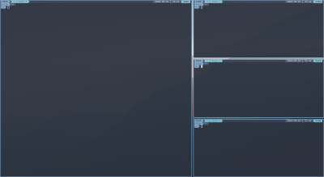
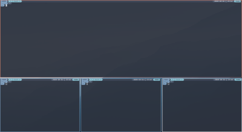
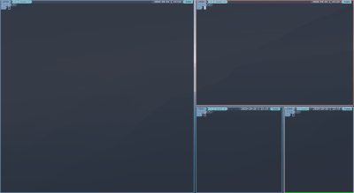
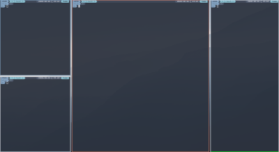

# i3-layouts


`i3-layouts` is a small program that enforces configurable dynamic layout on i3 workspace.

`i3-layouts` comes with 4 layouts: 
- `vstack`: one main windows with a vertical stack of windows.

- `hstack`: one main windows with an horizontal stack of windows.

- `spiral`: each new windows split the previous one, split direction alternates between
horizontal and vertical.  

- `3columns`: one main widows with two vertical stack of windows.


The [Layout section](#layouts) details the parameters for each one of these layouts. 

## Installation

### Requirements
Before installing `i3-layouts` be sure to have the following installed on your system:

* python >= 3.7
* [xdotool](https://www.semicomplete.com/projects/xdotool/)
* [i3wm](https://i3wm.org/)


### Installation with pip
To install, simply use `pip`

```
$ pip install --user i3-layouts
```

## Run
To start `i3-layouts`, simply type `i3-layouts` in a terminal,
or better yet, launch it from the i3 config file:

```
exec i3-layouts
```

## Configuration
Configuration is done directly in the i3 config file (usually `$HOME/.config/i3/config`).

`i3-layouts` reads the entire config file, filter all `$i3l` variables and 
keeps the associated values as configuration. If user defined variables are used
in `$i3l` variables value, they will be replaced by their own value.

### Assigning a layout to a workspace
Use the name of the layout as value for the `$i3l` variable, followed by its parameters and 
then the targeted workspace name.

Note that parameters are optional, but if given, they must respect the order described 
in the [Layouts](#layouts) section.

**Syntax:**

```
set $i3l [vstack|hstack|spiral|3columns] <param> ... to workspace [workspace name]
```

**Examples:**

```
set $ws1 1
...
set $i3l vstack to workspace $ws1
set $i3l hstack 0.6 up to workspace $ws2
set $i3l spiral 0.6 to workspace $ws3
set $i3l 3columns 0.66 0.5 2 left to workspace $ws4
```


### Switching layout

It possible to dynamically switch the current workspace layout by sending a `send_tick`
message with `i3-msg` to `i3-layouts`. The message must start with `i3-layouts` 
followed by one of the layout name or `none`:

- If a layout name is given, and windows are already present, 
they will be rearranged to match the selected layout.   
- If `none` is given, `i3-layouts` will not manage this workspace layout anymore.  

**Syntax:**

```
i3-msg -t send_tick "i3-layouts [vstack|hstack|spiral|3columns|none] <param> ..."
```
 
**Examples:**

```
i3-msg -t send_tick "i3-layouts vstack 0.6"
```

You can also use a keyboard binding in your i3 config file, for example:
 
```
bindsym $mod+s exec i3-msg -t send_tick "i3-layouts vstack 0.6"
```
  
### Layouts
Each layouts accept some specific parameters. 
These parameters must be given is the order described below.

#### vstack

Parameters:
* **main stack ratio** (float between `0` and `1`, default `0.5`): ratio of screen width used 
by the main stack
* **secondary stack position** (`right` or `left`, default `right`): vertical stack position 
relative to the main stack

#### hstack

Parameters:
* **main stack ratio** (float between `0` and `1`, default `0.5`): ratio of screen height used 
by the main stack
* **secondary stack position** (`top` or `bottom`, default `bottom`): horizontal stack position 
relative to the main stack

#### spiral

* **split ratio** (default `0.5`): ratio of width or height used by the previous container 
at each split, the remaining is used by the new container.

#### 3columns

* **main stack ratio** [two columns] (float between `0` and `1`, default `0.5`): 
ratio of screen width used by the main stack when only two columns are present
* **main stack ratio** [three columns] (float between `0` and `1`, default `0.5`): 
ratio of screen width used by the main stack when three columns are present. Width left
is distributed equally between the second and third columns
* **max number of row in the second columns** (int, default `0`): 
the third columns is created only when the second column reach this number of container. 
If `0` is given new container position alternate between the second and third columns.
* **second columns position** (`right` or `left`, default `right`): second column position 
relative to the main stack. Note that the third column will have the opposite position 
(if the second columns is on the left of the main stack, the third one will be on the right of 
the main stack)

## Limitations

* **User actions (split and move)**: `i3-layouts` do its best to manage the workspace layout, but if you manually 
split or move a container (with `split vertical|horizontal` for example), 
new container may be misplaced.
* **Redraw**: when container are closed, or moved between workspace, `i3-layouts` needs to reposition
some if not all containers of a given workspace. Right now, `i3-layouts` use `xdotool` 
to simulate the recreation of these containers, which is not ideal.
* **Marks**: to keep track of container position, `i3-layouts` use i3wm marks. 
More precisely, `i3-layouts` marks the first and last container of each workspace. 
