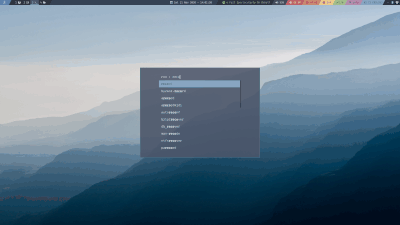
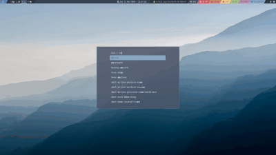
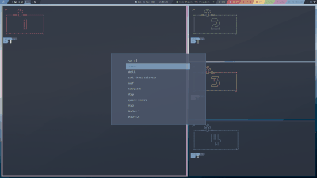

# i3-layouts


`i3-layouts` is a small program that enforces dynamic layout on i3 workspace. 
Each layout implemented comes with its own set of parameters. 

`i3-layouts` comes with 6 configurable layouts: 
- `vstack`: one main windows with a vertical stack of windows.


- `hstack`: one main windows with an horizontal stack of windows.



- `spiral`: each new windows split the previous one, split direction alternates between
horizontal and vertical.  


- `2columns`: two vertical stacks of equally sized windows.



- `3columns`: one main windows with two vertical stacks of windows.


- `companion`: each columns is made of one main window and one smaller window.


The [Layout section](#layouts) details the parameters for each one of these layouts. 

## Installation

### Requirements
Before installing `i3-layouts` be sure to have the following installed on your system:

* python >= 3.7
* [xdotool](https://www.semicomplete.com/projects/xdotool/)
* [i3wm](https://i3wm.org/)


### Installation with pip
To install, simply use `pip`

```
$ pip install --user i3-layouts
```


### Update with pip
To update, again use `pip`

```
$ pip install --user i3-layouts -U
```

## Run
To start `i3-layouts`, simply type `i3-layouts` in a terminal,
or better yet, launch it from the i3 config file:

```
exec i3-layouts
```

## Configuration
Configuration is done directly in the i3 config file (usually `$HOME/.config/i3/config`).

`i3-layouts` reads the entire config file, filter all `$i3l` variables and 
keeps the associated values as configuration. Note that user defined variables can be used
in `$i3l` variables, as they will be replaced by their own value.

### Assigning a layout to a workspace
Use the name of the layout as value for the `$i3l` variable, followed by its parameters and 
then the targeted workspace name.

Note that parameters are optional. However, if given, they must respect the order described 
in the [Layouts](#layouts) section.

**Syntax:**

```
set $i3l [vstack|hstack|spiral|3columns|2columns|companion] <param> ... to workspace [workspace name]
```

It's also possible to use any of i3 existing layout:

```
set $i3l [tabbed|splitv|splith|stacking] to workspace [workspace name]
```


**Examples:**

```
set $ws1 1
...
set $i3l vstack to workspace $ws1
set $i3l hstack 0.6 up to workspace $ws2
set $i3l spiral 0.6 to workspace $ws3
set $i3l 3columns 0.66 0.5 2 left to workspace $ws4
set $i3l 2columns right to workspace $ws5
set $i3l companion 0.3 0.4 up to workspace $ws6
```


### Switching layout

It possible to dynamically switch the current workspace layout by sending a `send_tick`
message with `i3-msg`. The message must start with `i3-layouts` 
followed by one of the layout name or `none`:

- If a layout name is given, and windows are already present, 
they will be rearranged to match the selected layout.   
- If `none` is given, `i3-layouts` will stop managing this workspace layout.  

**Syntax:**

```
i3-msg -t send_tick "i3-layouts [vstack|hstack|spiral|3columns|none] <param> ..."
```
 
**Examples:**

```
i3-msg -t send_tick "i3-layouts vstack 0.6"
```

You can also use a keyboard binding in your i3 config file, for example:
 
```
bindsym $mod+s exec i3-msg -t send_tick "i3-layouts vstack 0.6"
```

Using `notify-send`, it's possible to be notified of the selected layout when switching:

```
bindsym $mod+s exec i3-msg -t send_tick "i3-layouts vstack 0.6 && notify-send 'Layout vstack'
```

### Moving windows inside the layout



By default, when moving windows, chances are their position will not match the selected layout.
To keep windows within the layout available positions, `i3-layouts` must manage all `move` command.

So instead of configuring i3 with something like:

```
bindsym $mod+j move left
bindsym $mod+k move down
bindsym $mod+l move up
bindsym $mod+semicolon move right
```

`move` commands can be forwarded to `i3-layouts` with `i3-msg`:

```
bindsym $mod+j exec i3-msg -t send_tick "i3-layouts move left"
bindsym $mod+k exec i3-msg -t send_tick "i3-layouts move down"
bindsym $mod+l exec i3-msg -t send_tick "i3-layouts move up"
bindsym $mod+semicolon exec i3-msg -t send_tick "i3-layouts move right"
```

With this configuration, if a `move` command is executed on a workspace managed by `i3-layouts`, 
the moved window will stay within the layout. If the workspace is not managed by `i3-layout`,
 `i3-layout` will forward the `move` command to `i3`


### Layouts
Each layout accept some specific parameters. 
These parameters must be given is the order described below.

#### vstack
One main windows with a vertical stack of windows.

* **main window ratio** (float between `0` and `1`, default `0.5`): ratio of screen width used 
by the main window
* **secondary stack position** (`right` or `left`, default `right`): vertical stack position 
relative to the main window

#### hstack
One main windows with an horizontal stack of windows.

* **main window ratio** (float between `0` and `1`, default `0.5`): ratio of screen height used 
by the window stack
* **secondary stack position** (`up` or `down`, default `down`): horizontal stack position 
relative to the main window

#### spiral
Each new windows split the previous one, split direction alternates between
horizontal and vertical.

* **split ratio** (float between `0` and `1`, default `0.5`): 
ratio of width or height used by the previous container at each split, 
the remaining is used by the new container.
* **screen direction** (`inside` or `outside`, default `inside`): 
whether new container should be added towards the inside of the screen or the outside.

#### 2columns
Two vertical stacks of equally sized windows.
New window position alternates between the first and second stack.

* **first stack position** (`right` or `left`, default `left`): first stack position 
relative to the second stack.

#### 3columns
One main windows with two vertical stacks of windows.

* **main window ratio** [two columns] (float between `0` and `1`, default `0.5`): 
ratio of screen width used by the main window when only two columns are present
* **main window ratio** [three columns] (float between `0` and `1`, default `0.5`): 
ratio of screen width used by the main window when three columns are present. Width left
is distributed equally between the second and third columns
* **max number of row in the second columns** (int, default `0`): 
the third columns is created only when the second column reach this number of container. 
If `0` is given new container position alternate between the second and third columns.
* **second column position** (`right` or `left`, default `right`): second column position 
relative to the main window. Note that the third column will have the opposite position 
(if the second columns is on the left of the main window, the third one will be on the right of 
the main window)

#### companion
Each columns is made of one main window and one smaller window (called companion container below).

* **odd companion ratio** (float between `0` and `1`, default `0.3`): 
ratio of screen height used by the companion container for odd column index
* **even companion ratio** (float between `0` and `1`, default `0.3`): 
ratio of screen height used by the companion container for even column index
* **companion position** (`up`, `down`, `alt-up`, `alt-down`, default `up`): 
position of the companion container relative to the main window. `alt-up` and `alt-down`
alternate this position for each column, starting respectively at `up` and `down` for
the first column.

## Limitations

* **User `split` actions**: `i3-layouts` do its best to manage the workspace layout, but if you manually 
`split` a container (for example with `split vertical|horizontal`), new container may be misplaced.
For `move` command to work as expected, see [Moving windows inside the layout](#moving-windows-inside-the-layout)
* **Redraw**: when container are closed, or moved between workspace, `i3-layouts` needs to reposition
some if not all containers of a given workspace. Right now, `i3-layouts` use `xdotool` 
to simulate the recreation of these containers.
* **Marks**: to keep track of container position, `i3-layouts` use i3wm marks. 
More precisely, `i3-layouts` marks the first and last container of each workspace. 
